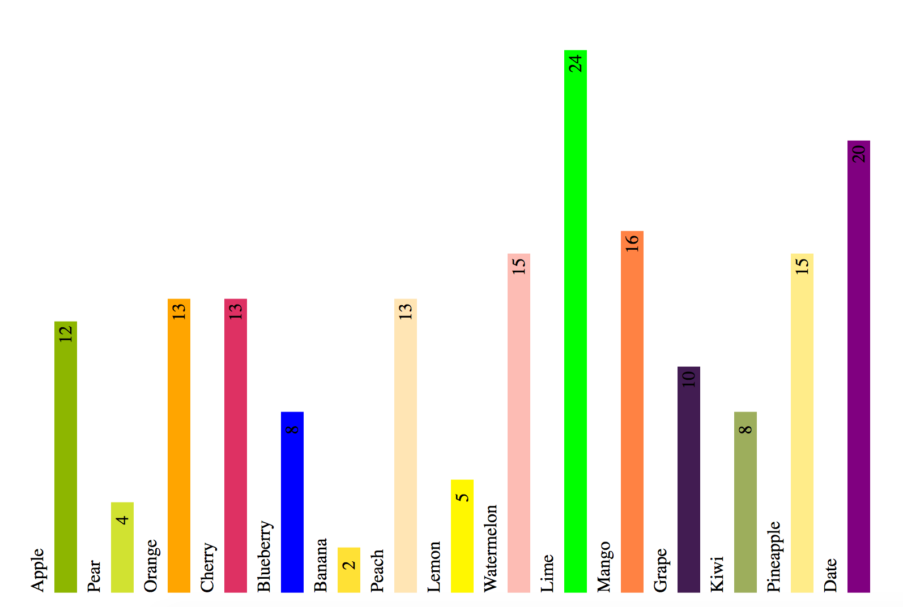
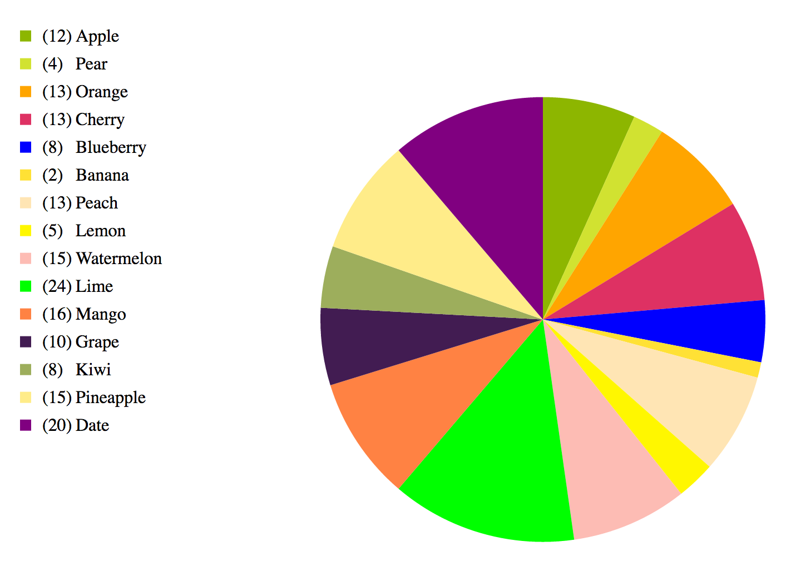
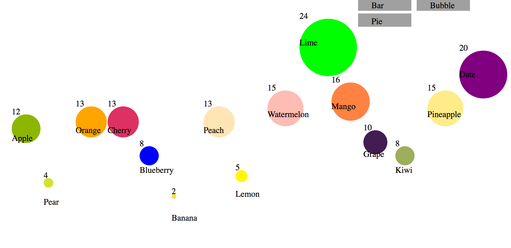

# Assignment 3 - Animated Transitions

Project link: [VisA to VisB to VisC](http://dvmanzo.github.io/03-Animation/index.html).

# Team

- Dan Manzo, dvmanzo

# Technical Achievements

I used the given data to make three different charts: a bar chart, a pie chart, and a bubble chart.

The bar chart uses the count of each fruit as the height value and the color of the fruit color as the color of the bar.

The pie chart uses the count of each fruit as the volume of each slice and also uses the fruit color as the color of the slice.

The bubble chart uses the count of each fruit as the size of the bubble itself and uses the fruit color as the color of the slice.

# Design Achievements

Transitioning from the bar graph to the bubble plot was much easier than dealing with the pie chart, but the piechart gave me a deeper knowledge
of how the animations and transitions work in D3.