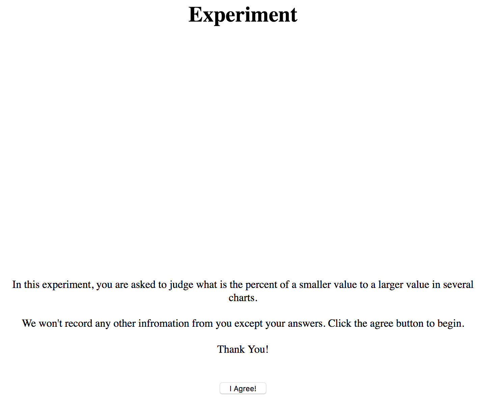
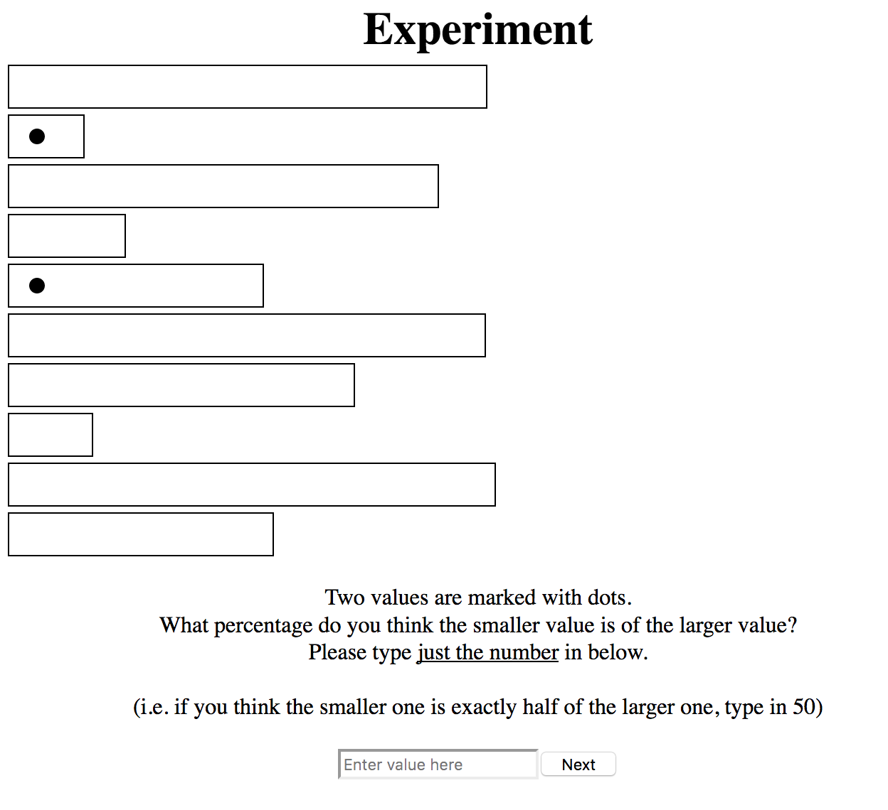
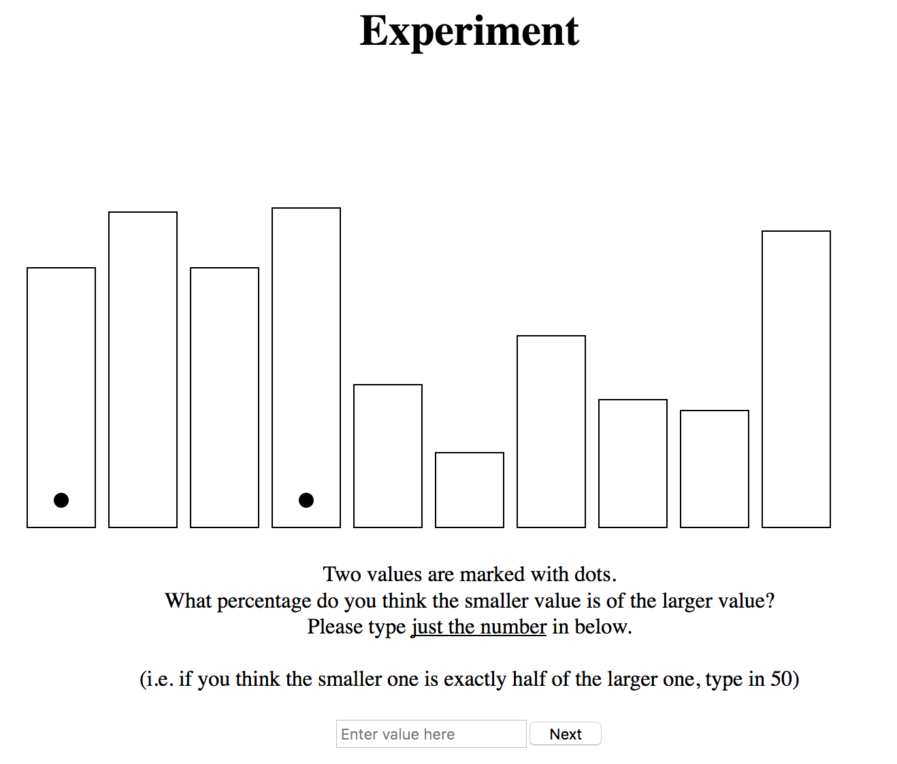
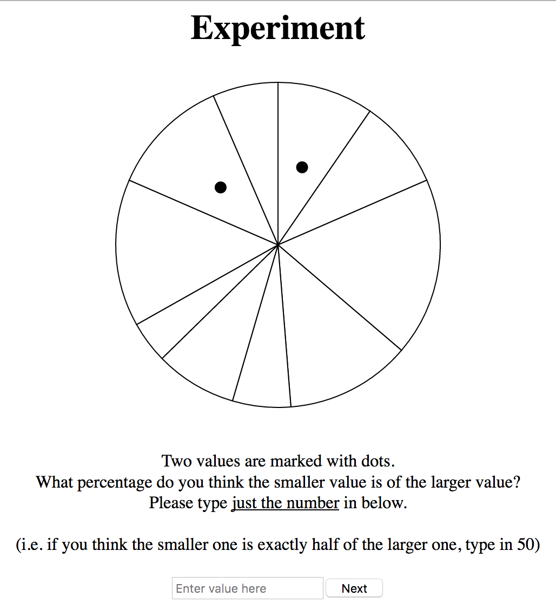
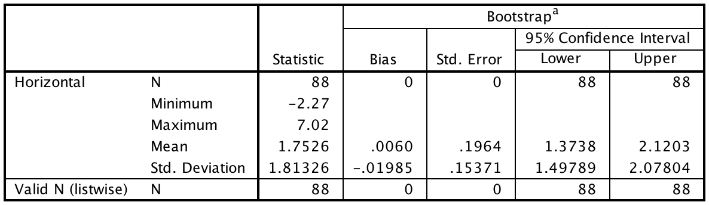
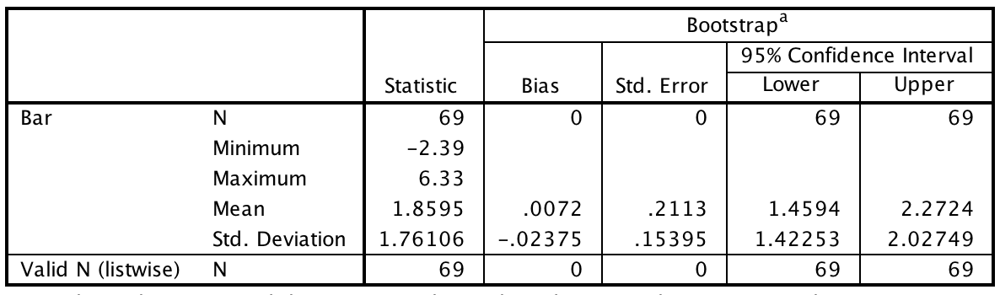
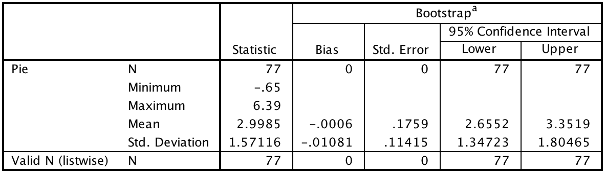

#Assignment 4 - Replicating a Classic Experiment  

##Dan Manzo (dvmanzo)

Project link: [Experiment](http://dvmanzo.github.io/04-Experiment/index.html).

#What I Did

I replicated the (Cleveland & McGill, 1984) study with the hypothesis that the values of bar charts (particularly vertical bars) were easier to recognize than those of a pie chart when comparing non-adjecent values. Using D3, I made three visualizations - bar chart (vertical), bar chart (horizontal), and pie chart - that will randomly generate 10 values and randomly select two of those values that are non-adjacent to eachother. Participants were given simple instructions (see below) and were given 6 visualizations that were randomly comprised of the three types of visualizations. I asked my Facebook friends to complete the task and assured them that I would not be collecting any personal information. All of their information was stored in a MySQL database using PHP (the code for sending it to the server is zipped so that it doesn't disrupt the GitHub repository). The demo link above is not storing data. If you'd like to run the experiment that stores the data, please email me.

##Example of the instructions given to participants when started.

##Example of the horizontal bar chart with two randomly marked bars.

##Example of the bar chart with two randomly marked bars.

##Example of the pie chart with two randomly marked slices.

#Results
I was able to get 43 people to participate in the experiment. Upon initial analysis of the data, I removed three participants scores because they entered 0 on one or more answers (which would never be the case and demonstrated a lack of understanding of what the experiment was asking). Out of the 234 observations, the vertical bar visualizations came up 69 times, the horizontal bars came up 88 times, and the pie charts came up 77 times. The average errors for each visualization type were calculated using the "cm error" formula and are as follows:

##Descriptives of the horizontal bar chart data error with a 95% confidence interval.

##Descriptives of the bar chart data error with a 95% confidence interval.

##Descriptives of the pie chart data error with a 95% confidence interval.

#Conclusion
It is clear that the error rate for pie charts was significantly higher than the two bar charts. While I expected the vertical bar charts to outperform both groups, the horizontal bars were the best performing of the three groups by a slight margin.