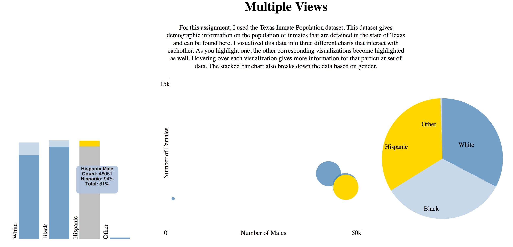
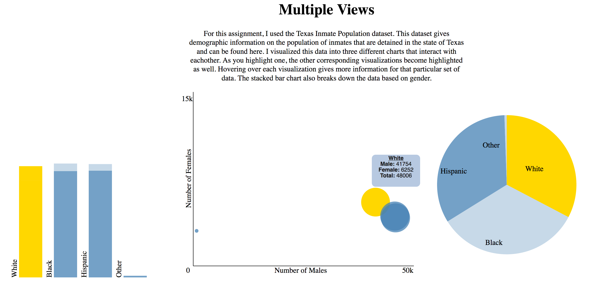

#Assignment 5 - Visualizations and Multiple Views  

##Dan Manzo (dvmanzo)

Project link: [Experiment](http://dvmanzo.github.io/05-MapsAndViews/index.html).

#What I Did

For this assignment, I used the Texas Inmate Population dataset. This dataset gives demographic information on the population of inmates that are detained in the state of Texas and can be found [here](http://www.tdcj.state.tx.us/documents/High_Value_Data_Sets.xlsx). I visualized this data into three different charts that interact with eachother. As you highlight one, the other corresponding visualizations become highlighted as well. Hovering over each visualization gives more information for that particular set of data. The stacked bar chart also breaks down the data based on gender.

##Example of the stacked bar chart showing the values for the bottom part of the bar (Hispanic males).

##Example of the bubble chart that is plotted using the male and female values as coordinates.

#Technical Achievements
In addition to just importing the data into three different visualizations, I linked all three charts together so that when you highlight one area of one chart, it highlights the corresponding areas from the other two visualizations. I also added tooltip divs to give an enhanced view of information when highlighting various areas of the visualizations.

#Design Achievements
I used colors as accents when highlighting various areas. I also used a strong silver when selecting a particular area of a stacked bar chart to contrast the gold that appears when highlighting a section.

