# 02-DataVis-10ways
## Dan Manzo (dvmanzo)

# Python
Python is a very popular language that has sophisticated plotting libraries.
I used the mathplotlib library for charting in Python as well as NumPy for the statistical data.
I used the DictReader function to import the data and then used the matplotlib plot to actually plot it according to position, color, and size.
To make things easier, I encoded the colors in the csv file by Manufacturer and then had that be parsed into the plot.

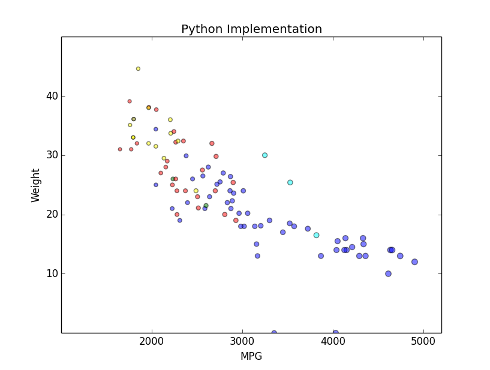

# R
R is a language primarily focused on statistical computing.
I used the standard library for charting in R.
I used read.csv to import the data and then used the standard R plot to actually plot it according to position, color, and size.
To make things easier, I encoded the colors in the csv file by Manufacturer and then had that be parsed into the plot.

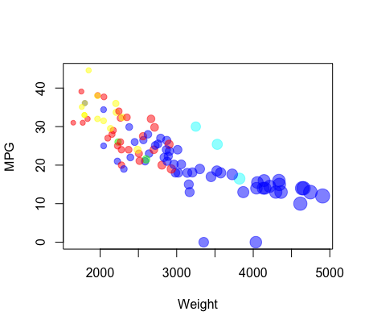

# Javascript/D3
JavaScript is a high-level, dynamic, untyped, and interpreted programming language.
I wrote the plots myself using the D3 library for creating circles and used the D3 csv function to read the data.
To make things easier, I encoded the colors in the csv file by Manufacturer and then had that be parsed into the plot.

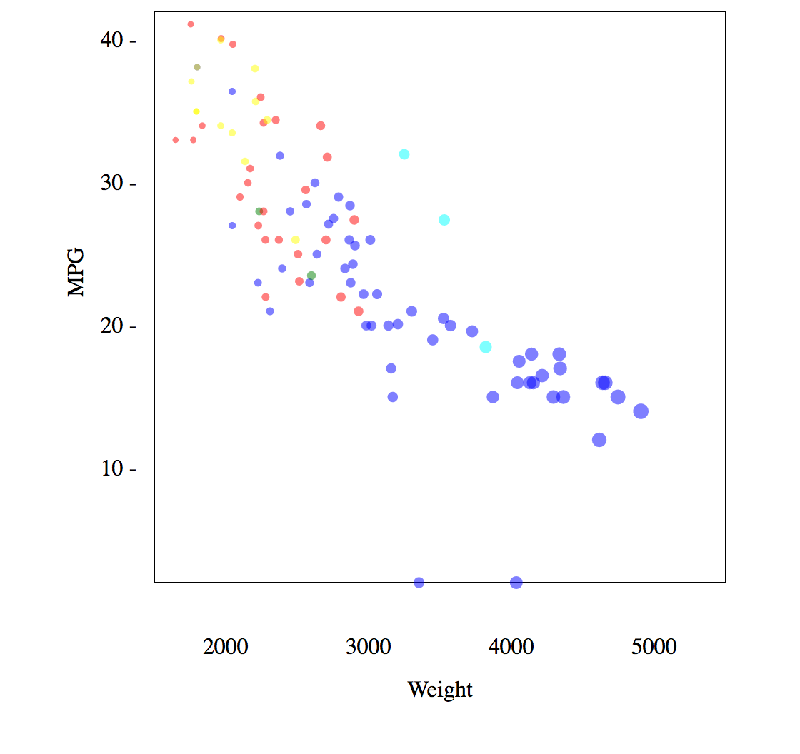

# Amchart
Amchart is a Javascript library for creating stunning, interactive charts.
I used their documentation from their website to get started, but completely customized the chart to meet the assignment requirements.
I also used jQuery for their CSV function to import the data from the csv file.
To make things easier, I encoded the colors in the csv file by Manufacturer and then had that be parsed into the plot.

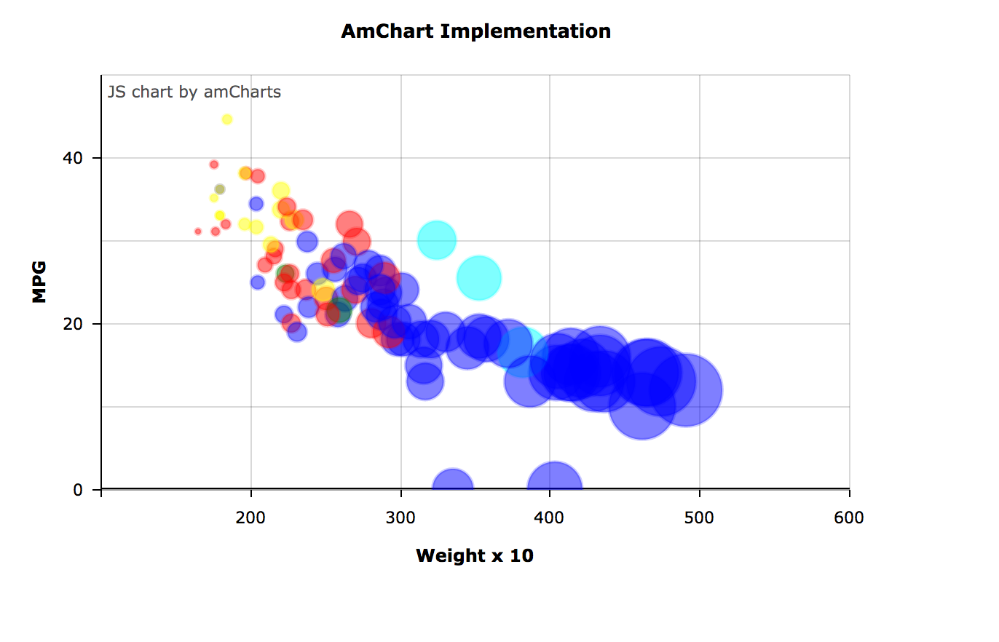

# CanvasJS
CanvasJS is an awesome library for creating beautiful charts in JavaScript.
This library was my favorite to use by far.
I used their documentation from their website to get started, but completely customized the chart to meet the assignment requirements.
I also used jQuery for their CSV function to import the data from the csv file.
To make things easier, I encoded the colors in the csv file by Manufacturer and then had that be parsed into the plot.

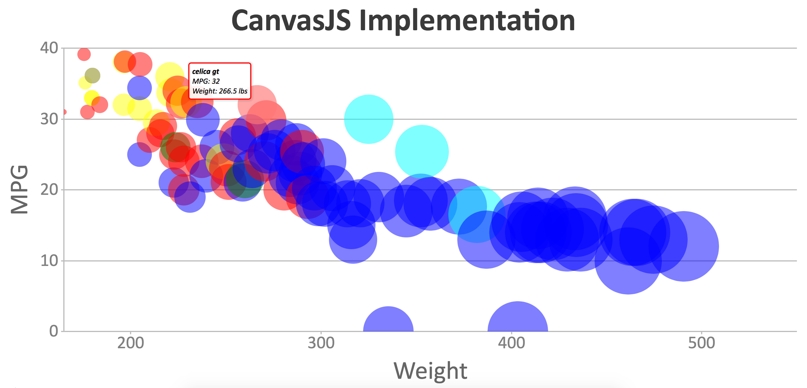

# Excel
Excel is a software application used for statistics and computing and is part of the Microsoft Office suite.
It was a bit of a pain to get things working the way I wanted them in Excel, but I got it working.
I also tried using SPSS as a step-up from Excel, but you weren't able to customize pretty much anything.

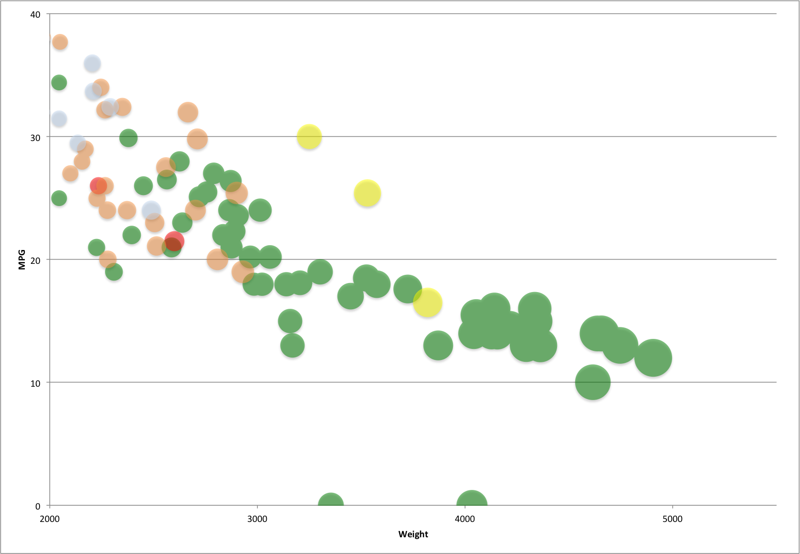

# Fusion Charts
Fusion Charts is a light library for creating charts in JavaScript.
I used their source code for bubble charts, but completely customized it to meet the assignment requirements and make it my own.
I also used jQuery for their CSV function to import the data from the csv file.
To make things easier, I had to encode the hex codes of the colors I wanted in the csv file by Manufacturer and then had that parsed into the chart.

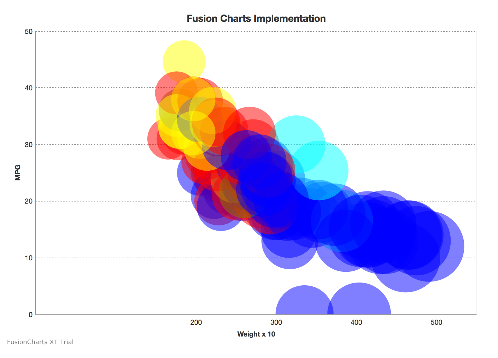

# Tableau
Tableau is a software application used for designing complex charts, graphs, and other statistical visualizations.
It was very easy to make the bubble chart with my desired specifications and if I had to use an actual software program
to make a nice visualization, I would use Tableau over Excel anyday.
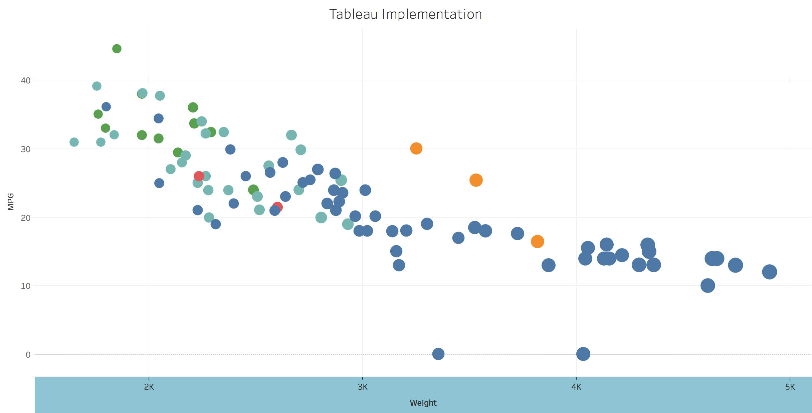

# Highcharts
Highcharts is an extensive library for creating charts using JavaScript.
I read their thorough documentation and had the chart running quickly using one of their examples as a guide.
Overall, it was pretty easy compared to some of the other JS libraries.
I also used jQuery for their CSV function to import the data from the csv file.
To make things easier, I encoded the colors in the csv file by Manufacturer and then had that be parsed into the plot.

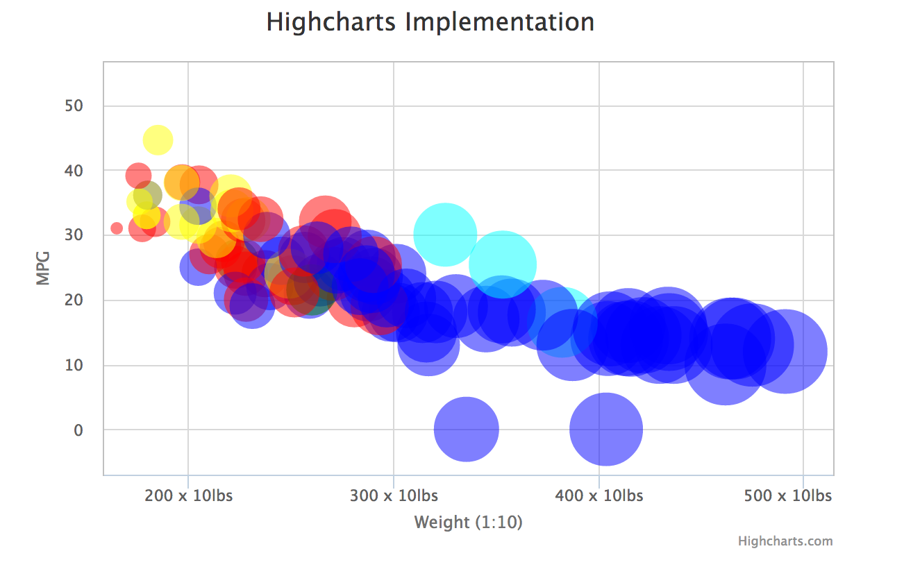

# Google Charts
Google Charts is Google's attempt at making it's own type of charting library.
It required minimal work to get things started and was pretty clear with it's documentation as you'd expect from Google.
Definitely easy to use, but I don't feel like I had as much control as I would using another library.
I used jQuery for their CSV function to import the data from the csv file.
To make things easier, I encoded the colors in the csv file by Manufacturer and then had that be parsed into the plot.
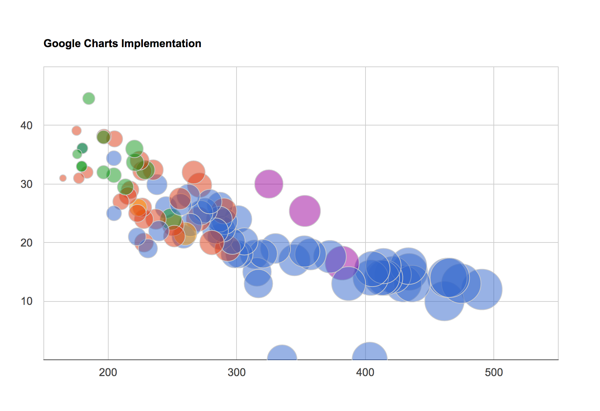

## Honorable Mention: PHP - JPGraph
PHP is a programming language used for web applications and development.
Making graphs is not something you would normally use PHP for, but I wanted to experiment a bit and found a library, JPGraph, that
made things a bit easier.
Although, I was able to plot the graph, the customization of it is lacking and the documentation was not very good.
It was a good experiment, but I'd never recommend using PHP for something like that especially because it cooperates well with JavaScript anyway.
To make things easier, I encoded the colors in the csv file by Manufacturer and then had that be parsed into the plot.
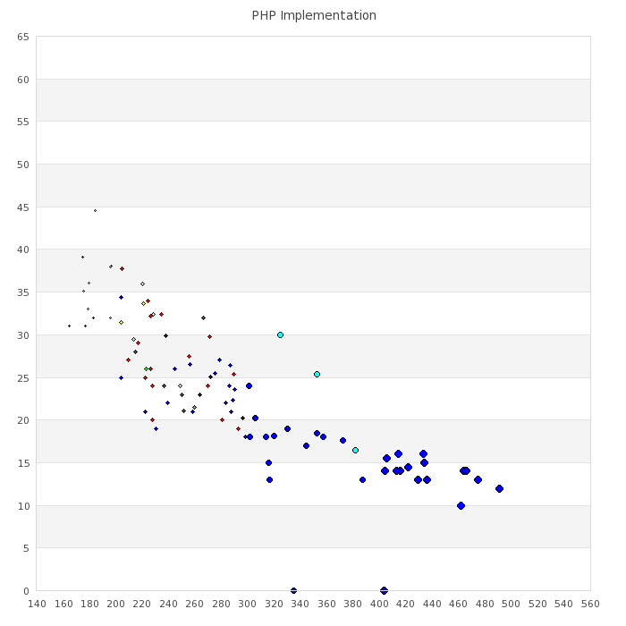

