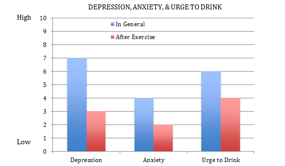
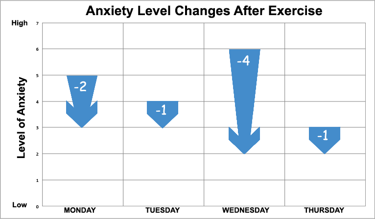
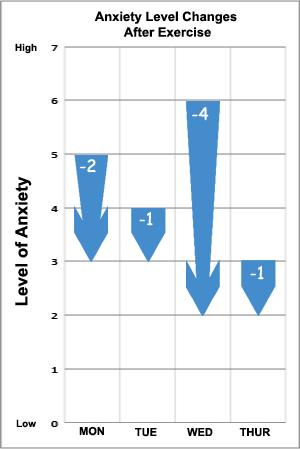
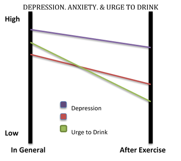
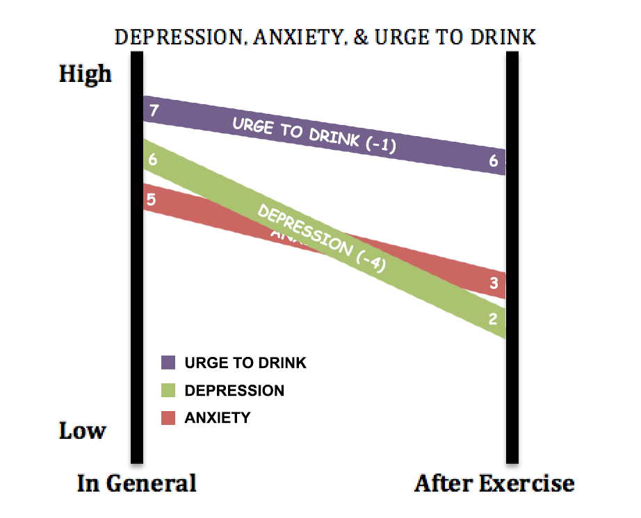
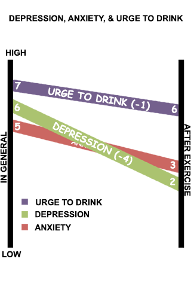

# Lab -- Improving charts

Link: [http://dvmanzo.github.io/lab-alcoholstudy/index.html](http://dvmanzo.github.io/lab-alcoholstudy/index.html)

Team:

- Dan Manzo, dvmanzo

## Visualizations

I made this particular visualization with one single bar to reflect the change per day rather than having to make comparisons between the two bar charts for each day. The arrow is tapered so that you can see which direction it is going regardless of where you are looking. Also, in the event of an increase, the arrows would be red.

Here is a mobile version, the width is at a minimum of 320px which will fit on any standard smart phone.

The slope chart is a more intricate way to express the changes than the original bar, but it is difficult to follow along with which bar is what and how the changes are relative to each side. I remedied this by including the labels on the slopes themselves with the intervals next to the label. I also labeled the starting value and ending value of each slope to get a better reading.

Here is a mobile version, the width is at a minimum of 320px which will fit on any standard smart phone.

## Here is the updated document using both charts

 - [Hello, good lookin'](Brief1.docx)