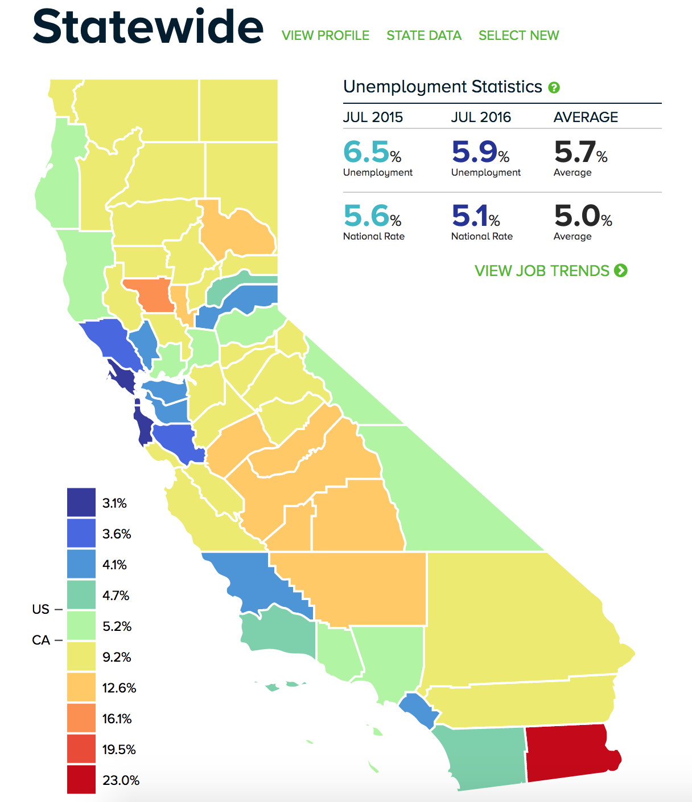
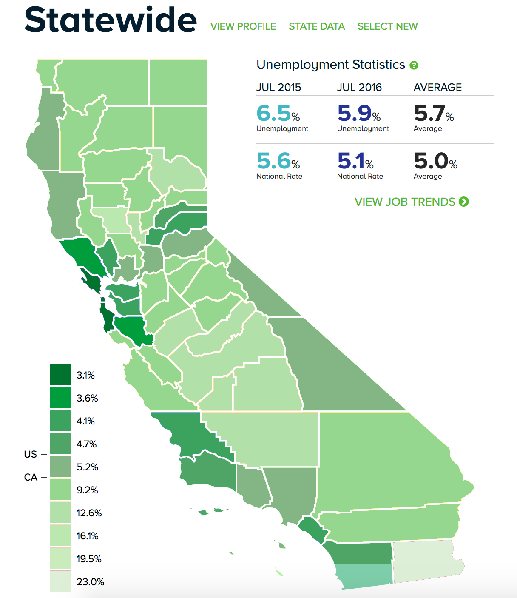
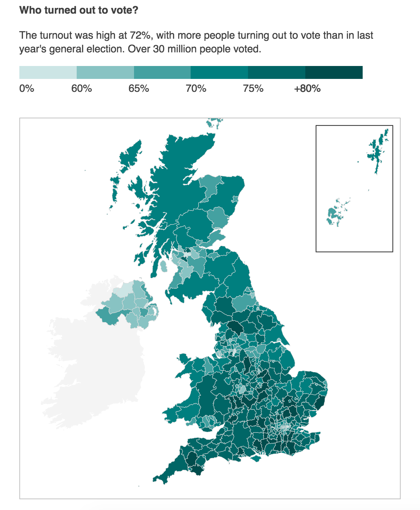
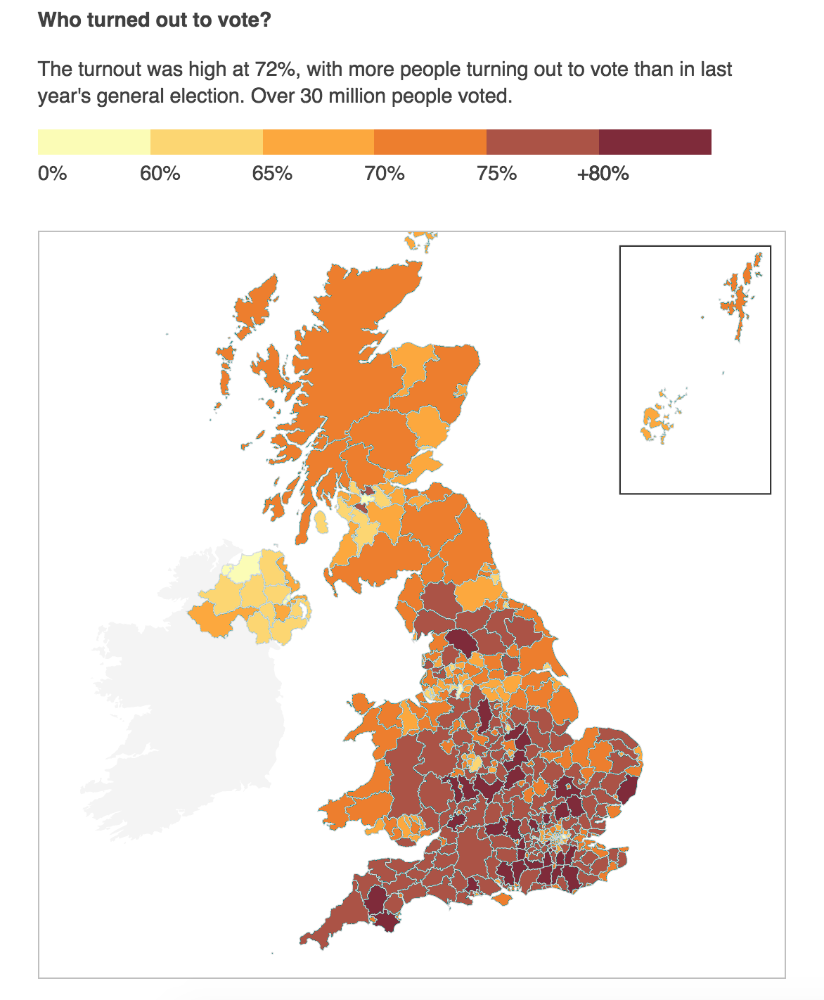

# Color Lab

Teammates:

- Cut Famelia, CutFamelia
- Hamid Mansoor, hmanso02
- Dan Manzo, dvmanzo

# Unemployment rates in California, by county

We found a visualization that showed the varying levels of unemployment across the counties in California. The counties were colored from blue to red, in increasing degrees of unemployment. We inferred the author's intent for using blue for low unemployment levels to convey a sense of prosperity and security, whereas the use of red is to convey alarm. We think that it would be more suitable for this visualization to use varying brightnesses of a single color, namely green. Having too many colors may confuse the viewers about the information being presented. Green can also be used to convey the level of prosperity in a county as most people in the US associate green with money. We used dark green for low unemployment counties and lighter shades for higher unemployment counties. We used Colorbrewer to redesign the coloring scheme for this visualization. The new coloring was implemented on the visualization using Photoshop. 

Here is the link to this visualization: http://www.centerforjobs.org/data-tool/

# EU referendum 

We found a visualization on BBC about the voter turnout in the UK for the referendum to leave the EU. The visualization divided the UK into small voting regions (their equivalent of counties) and colored them using different shades of green, with lower shades representing lower turnout and darker shades representing higher turnout. It was difficult to distinguish between the turnouts for similarly shaded regions, with the coloring scale that they had used. We used Colorbrewer to come up with a new coloring scheme which was multi hue, from light orange to dark red. When we applied this scheme using Photoshop, we could distinguish between the turnouts of differnet regions more easily. 

Here is the link to this visualization: http://www.bbc.com/news/uk-politics-36616028