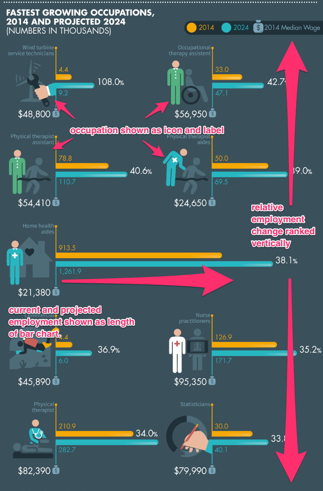
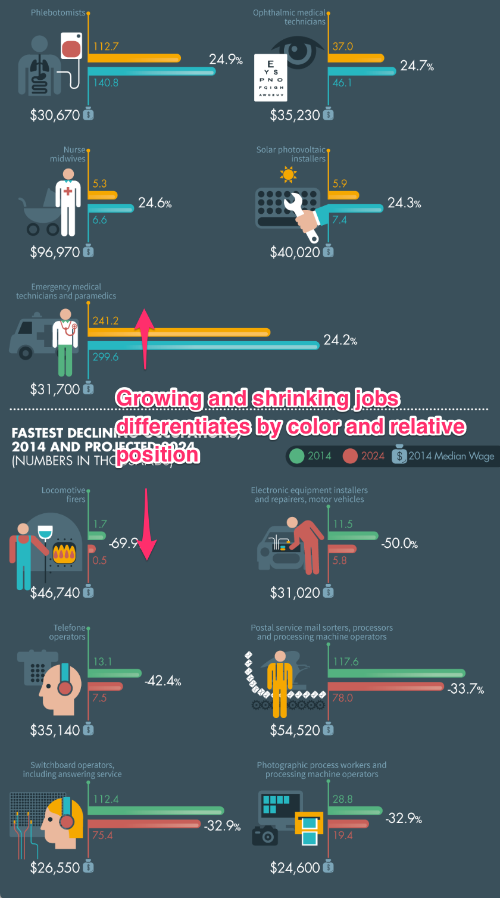
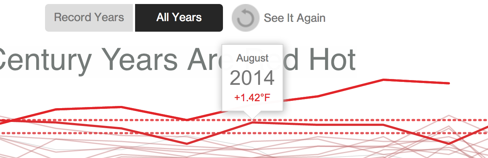
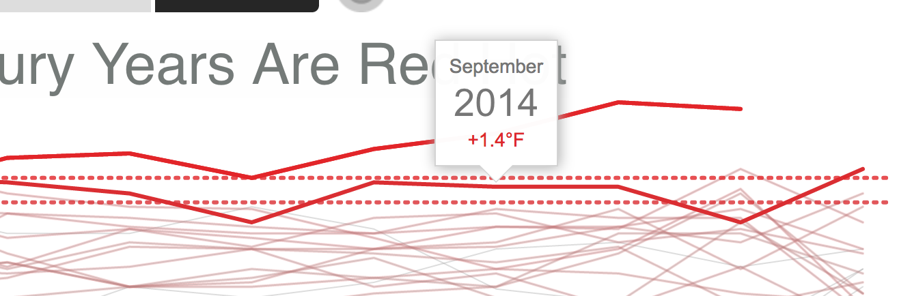
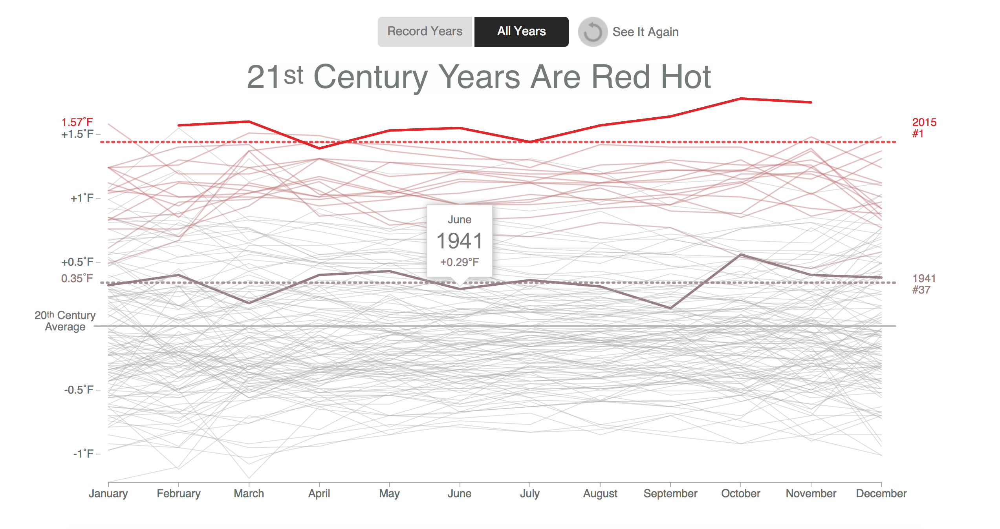

#Data Deconstruction Lab
Scott Judson (sajudson), Dan Manzo (dvmanzo)

# Future of Work - Fastest Growing and Declining Occupations
The Future of Work Visualization found on visual.ly (http://visual.ly/future-work-60-fastest-growing-and-declining-occupations-united-states) 

This visualization displays the following information:
-  the current and project employement figures (jobs)
	- ratio data, 
	- encoded as length of horizontal bars
-  the expected change employment relative to current employment (%)
	- ratio data, 
	- encoded as ordinal, represented as vertical position in visualization
-  occupation 
	- nominal data
	- encoded as icon and label 

Current and projected employment data is encoded as the length of the bars in the chart, and using different hues to represent the current and future employment provides a accurate picture, but differences in the scales and/or baselines used to plot the bars detracts from the overall accuracy, and the placement of bars on both side of the chart make comparisons more difficult.

The change in employment (as a %) is ratio data, but it is encoded as ordinal (i.e., rank) as the vertical position/order of the occupation in the visualization. In addition to the postition and each occupation is also labeled. The use of relative change rather than the absolute change is consistent with the stated goal of chart (fastest growing professions), but is somewhat misleading because the ranking is based on percentage change, rather than the total increase in employment, and some of the fastest growing professions have low current employment (e.g., wind turbine technicians grow by >100%, but increase by only 5,000 jobs). Encoding the growing and shrinking occupations with different colors was good, but the 

Occupations (nominal attributes) are denoted by large , and relatively complex, icons adjacent to the bars, as well as labels in a comparitively small font just above the icon. The use of icons in addition to the labels is an unecessary complication in the graph.

The data is taken from the Bureau of Labor Statistics, and does not appear to have been aggregated or transformed.

The change in employment encoding is good, but comparisons would be made easier by arranging the occupation data into a single column. While the employment data was encoded appropriately, plotting the absolute change in employment as a bar (i.e., length), and using a a common baseline and scale for all occupations would focus on the most important aspect of the data, and would show growing and shrinking occupations as positive and negative values respectively. The use of the icons for occupations was a poor choice, increasing the vertical dimension of the chart and making comparison of different occupations more difficult - Labeling the horizontal bars would be sufficient. More detailed employment data, % change, averaged salary and occupations icons should be used as supplemental information (e.g., display on mouseover) in an interactive chart. 

# Climate Change - Interval, Ordinal

The visualization of temperature recordings of each month and year around the last century on bloomberg.org shows one primary variable in a 12-month calendar line graph: the relative temperature of each month and year for the past 135 years.

The y-axis is interval data that ranges from -1 degrees Fahrenheit to +1.5 degrees Fahrenheit around the average of the 20th century and shows the difference from the previous month and year. The x-axis is ordinal data that lists each of the 12 months of the year and shows the relative changes from one month to the next using a line graph. It is very cool that they not only show you the increase/decrease of the overall year compared to the previous year, but you can also view the increase/decrease of a specific month compared to that month in the previous year. Overall, the x-y mappings are a clear choice and do illustrate the point of the visualization itself (climate change).

 

The visualization starts with a cool animation that shows the progression in temperature increases over the years with a notification of each new record high as it moves along, but the animation itself takes around 20 seconds to complete. Overall, it is kind of annoying because you can't skip it nor can you interact with anything prior to it finishing.

The color is mapped to the overall temperature with low temperatures in gray and high temperatures in red. Being colorblind, it was not possible to see the distinction between the less-extreme colors and completely failed to see the yellow coded lines (I'm sure this was not considered). The overall shift upward in temperature is clear (which was their main point, I'm assuming), but they way they overlayed each year's line made it pretty much impossible to locate a specific year if you wanted to view them in order without the animation. (i.e. 1937 is the lowest year on temperature, but 1880 is extremely difficult to isolate. This would have been better if they had an option to switch the view to just the plot of average annual temperatures and see the progression that way.

The toggle between the "record" years and overall years is a nice way of saying, "Do you want to see the data we want to show you or do you want to see the data that we are still willing to show you?". Also, the data itself is a bit misleading -- a quick Google search would show that the 2008 was the hottest year followed by 2010. Again, this visualization should have had an option to view a line graph of just the average temperatures or at least arrange the whole dataset so that the user could see some type of meaningful timeline. This also would have removed the "21st century average" as the center point, which is a weird and arbitrary center point when you're analyzing 135 years of data.

This dataset is aggregated. It is a merged land-ocean surface temperature analysis. According to the data source, it is a spatially gridded global surface temperature dataset with monthly resolution from January 1880 to 2015.

