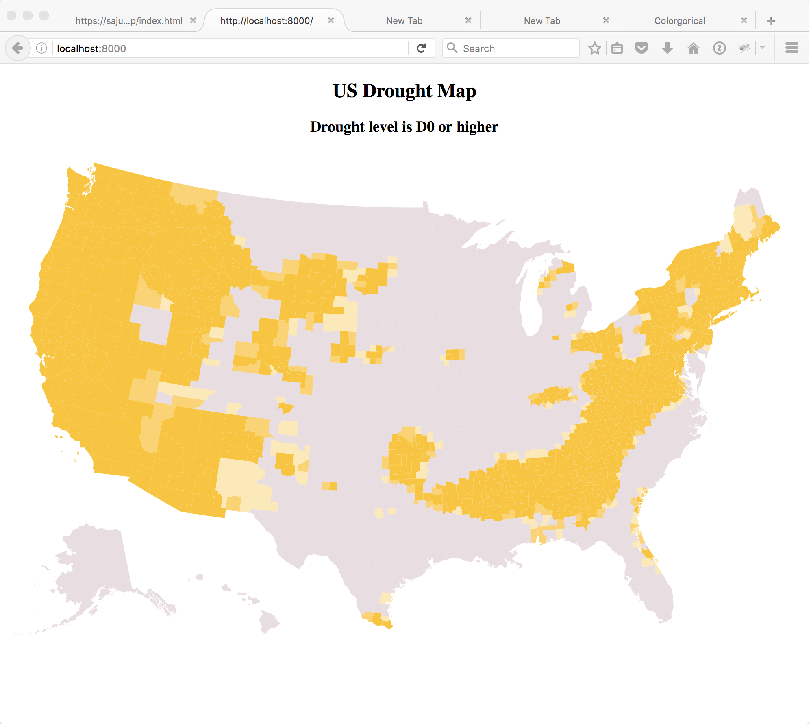
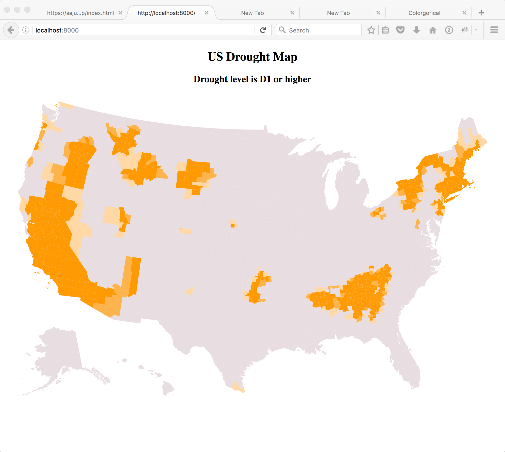
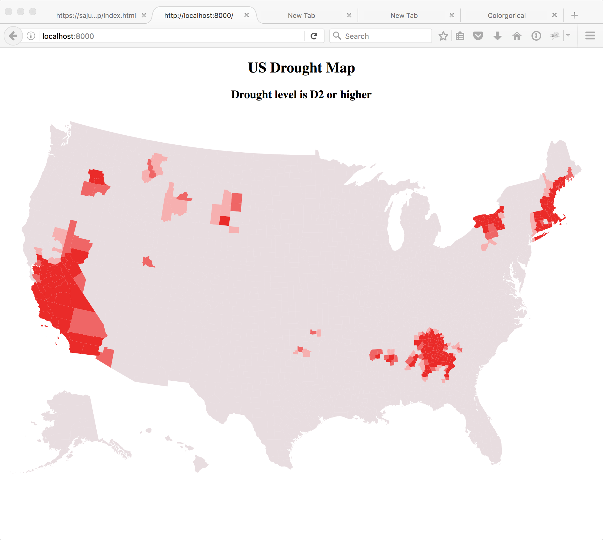
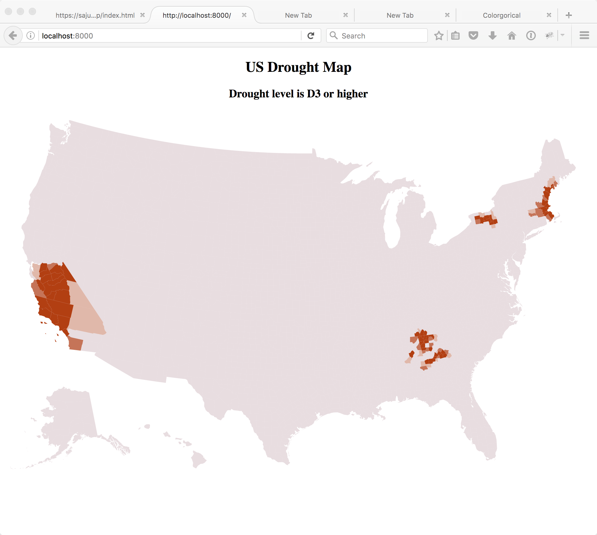

# Lab -- Maps

Link: [https://sajudson.github.io/lab-map/index.html](https://sajudson.github.io/lab-map/index.html)

Team:

- Dan Manzo, dvmanzo
- Scott Judson, sajusaon

We chose to create an d3 chloropleth that transitioned between the display of the five different levels of drough (D0 through D3), encoding each chart as a different hue for fill, with the fraction of the land in each county encode into four levels: <25%, 26-50%, 51-75%, and 85-100% using a neutral base map color for counties with less than 25% of the county at the stated drought level alpha, and alpha of 0.40, 0.75 and 1.00 for the three remaining levels. By limiting the number of levels and choosing the alpha encoding carefully, we were able to create four discrenable rates of drought for each level of drought.

## References

- The drought data idea and example map come from [Bob Rudis](https://twitter.com/hrbrmstr)
- [Lets Make A Map](http://bost.ocks.org/mike/map/)
- [Interactive and Multivariate Choropleth Maps with D3
](http://www.cartographicperspectives.org/index.php/journal/article/view/cp78-sack-et-al/1359)
- Source of drought data [Drought.gov](https://www.drought.gov/drought/)
- Colorgorical

##Contributions:
Dan and I reviewed the example and developed the overall technical and visualization strategies together. Dan adapted the code to bind the data directly to the map and to cycle through options. Scott developed the color hue and alpha encoding scheme, and worked with Dan to implemented it in the code. Scott and Dan worked togther to debug the code.Scott prepared the writeup and documented the resources used. 
