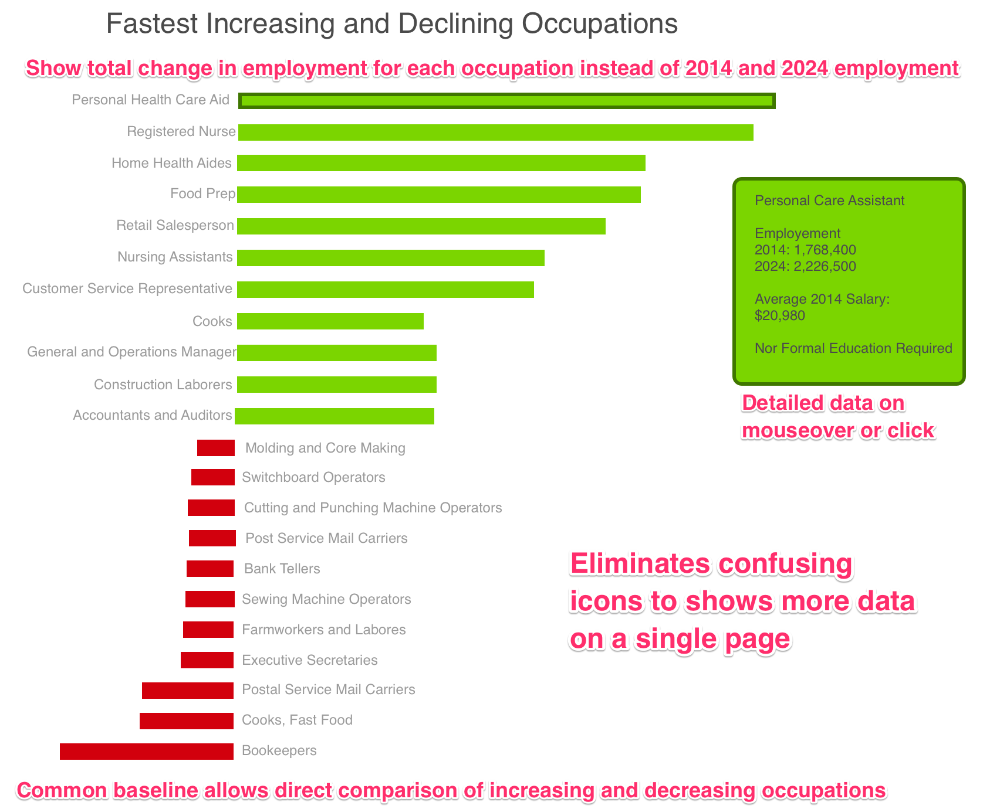
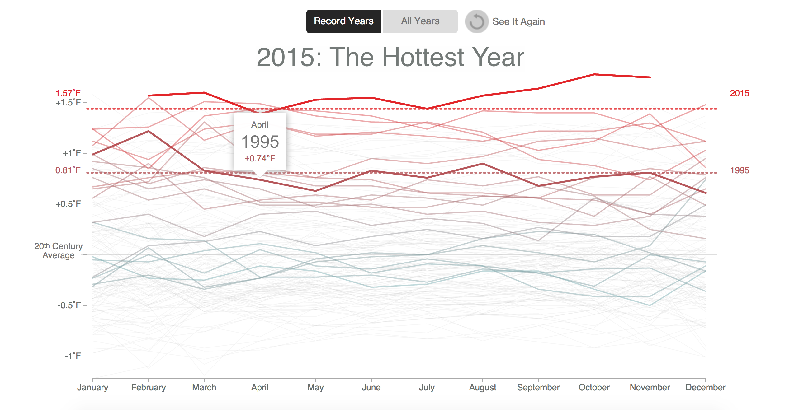
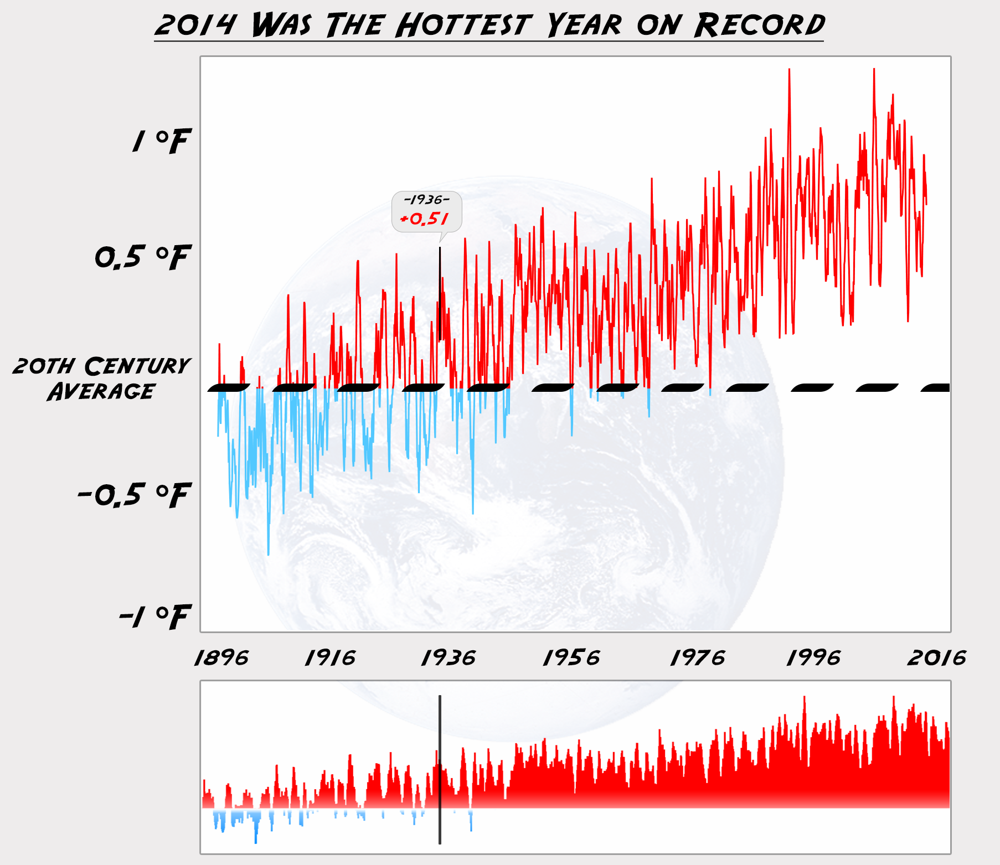

#Data Reconstruction Lab
Scott Judson (sajudson), Dan Manzo (dvmanzo)

# Fastest Growing and Declining Occupations - Revisited

We developed a prototype visualization to address the most serious flaws in the The Future of Work Visualization found on visual.ly (http://visual.ly/future-work-60-fastest-growing-and-declining-occupations-united-states) 

1. We chose to display the total increase in employement between 2014 and 2014, rather than the total employment data in 2014 and 2024, and placed all of the occupations on the same baseline. We retained length as the primary encoding using horizontal bars, and colored the bars for increasing and decreasing occupantions different colors. 

2. We eliminated the icons and replaced them with the name of the occupation. The labels were adjacent to the horizontal bars, on the left and right for increasing and declining occupations respectively.

3. We propose to add a interactive elements so that when a specific bar or label is hovered over, detailed data for the occupation is provided from the Burea of labor statistics wweb site, including education requirements and average starting 2014 salary. 

These changes provide a better overall picture of the increasing and declining occupantions by focusing on the total number of jobs and by making it possible to directly compare any occupation to the others. Access to all of the data provided in the original (and potentially quite more) is retained by providing detailed data on specific occupations as a text box that appears when a occupation label or bar is selected (mousover or click), with the the text box and the selected bar highlighted by a darker border in the same hue as the bar. 

Data source:http://data.bls.gov/projections/occupationProj

# Climate Change - Revisited

We also redesigned the visualization and interaction of the 2014 Was The Hottest Year on Record Visualization (http://www.bloomberg.com/graphics/2014-hottest-year-on-record/) 

###Original

###Redesign

1. We replaced the 135 individual line charts with one line chart ranging from 1896 to 2016. The new chart shows a data point for each month for each year on the x-axis, while the average temperature for that month is on the y-axis compared against the 20th century average. 

2. We also added a visual over/under area chart to the bottom with the 20th century average being the baseline. As you scroll along the timeline on either graph, you'll see a vertical line highlighting the temperature for that particular time in the chart.

3. We also encoded a color scheme for each of the data values. Anything that is under the 20th century average is colored with a light blue gradient and anything over is colored with a deep red gradient.

These changes provide a better perspective on the upward trend in average temperatures across a progressive timeline. As opposed to the old one where you can't really decipher which line was the earliest date, this line graph shows the drift clearly over time. Additionally, the interactions from the old ones were improved a bit so that you can see any average from any date without having to search around for the earliest line (which may or may not even be accessible in the old one). Lastly, the color overlays distinctly show which points are at what temperature in relation to the century average and help users quickly underrstand what a value of a temperature may be without having to hover over it. 

Data source: GHCN-M & ICOADS Data Sets Provided by NOAA