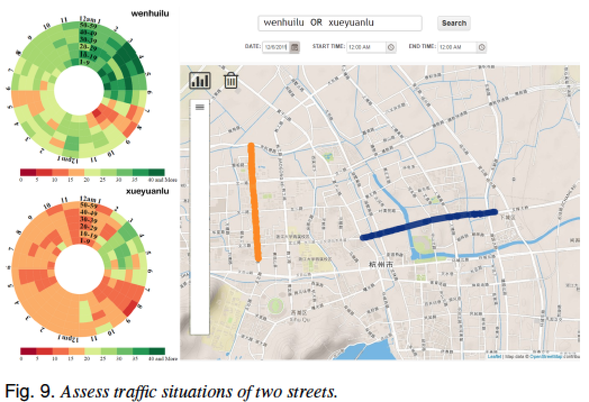
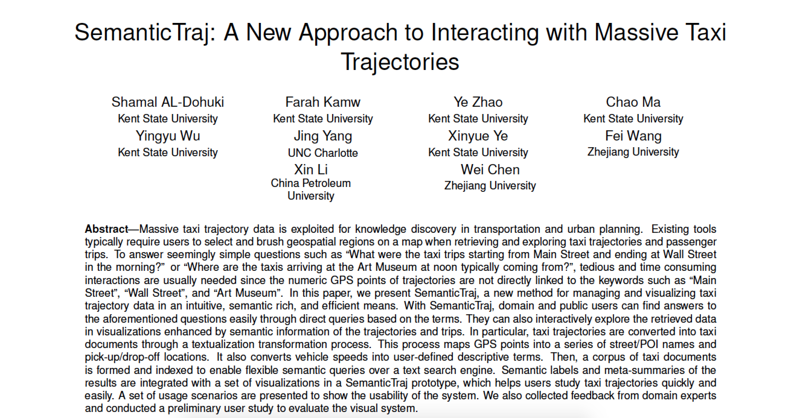

# Lab -- VIS Research

Team (since we're doing 7 minute presentations, you may have 2 teammates in addition to yourself):

- Dan Manzo, dvmanzo

### Paper Selected
SemanticTraj - A New Approach to Interacting with Massive Taxi Trajectories
Shamal AL-Dohuki, Farah Kamw, Ye Zhao, Jing Yang, Chao Ma, Yingyu Wu, Xinyue Ye, Fei Wang, Xin Li, Wei Chen

### Why we chose it
I chose this paper because it seemed relevant to the large dataset that I plan to visualize in my final project. The many attributes of the taxi trajectory data cover similar attributes found in the NYC Stop-and-Frisk data such as coordinates, time, description of the event, etc. I was also intrigued by the way that they broke down the data and visualized it to provide narratives that tell a story rather than just report data. This is evident in such tasks as the criminal activity feature or abnormal behavior.

[Slides](http://dvmanzo.github.io/lab-research/presentation.pptx)
