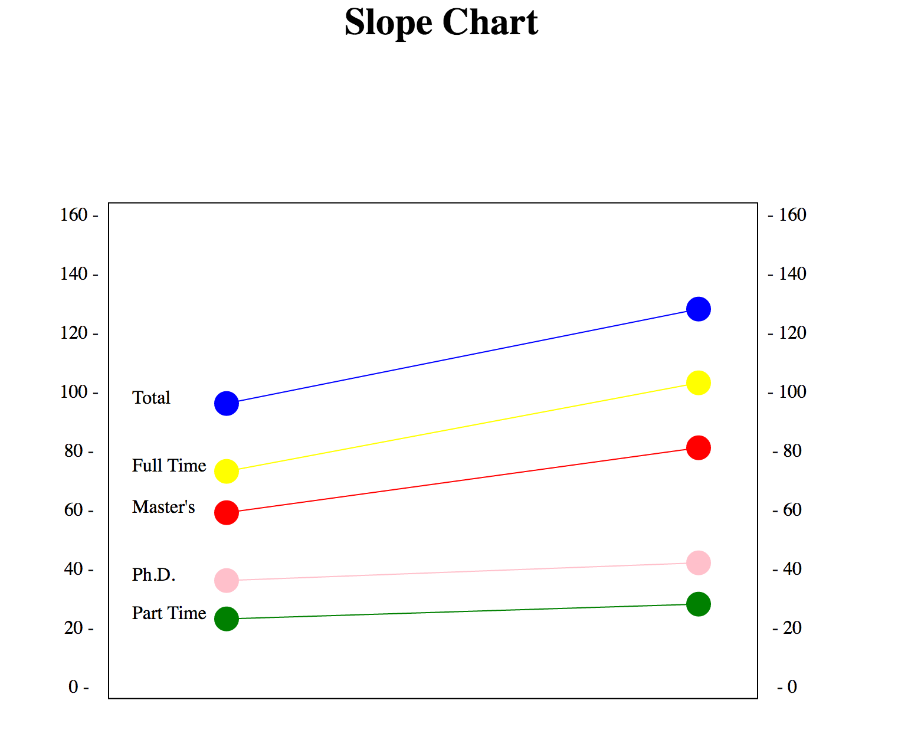

# Lab -- Making a Slopechart

Team:

- Dan Manzo (dvmanzo)

I wrote the slopechart in D3 using circles, rects, and lines.

I put the data points in a 2D array including the beginning and ending year of the chart, the label, and the color.
A for-loop goes through each point and draws a circle at each end with a radius of 10 and labels it with the appropriate label.
A line is then drawn with the y values mapped to each point and the x values spaced out so you can see the slope.

I also made a for-loop to add the axis labels to both sides and then drew a rect around the grid. See screenshot below.

